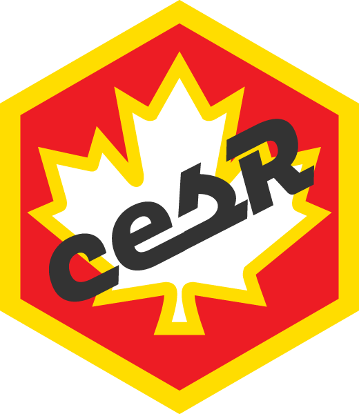

<!-- README.md is generated from README.Rmd. Please edit that file -->

```{r, include = FALSE}
knitr::opts_chunk$set(
  collapse = TRUE,
  comment = "#>",
  fig.path = "man/figures/README-",
  out.width = "100%"
)
```

# cesR 

#### Access the Canadian Election Study Datasets a Little Easier. 

<!-- badges: start -->
<!-- badges: end -->

---

## Installation

You can install the current version of this package using:

``` r
devtools::install_github("hodgettsp/cesR")
```
---

## Using the Package

  The `cesR package` provides access to the CES Surveys through the use of a function call `get_ces(srvy)`. Where variable `srvy` is an associated survey code entered as a character string. On a call, the `cesR package` wiil create a data object for the requested survey. Survey code calls can be found in the table provided below. On a call, the `cesR package` will additonally print out the citation for the called survey dataset. Additionally, it is possible to lookup the survey codes within the package through the function call `get_cescodes()`. This function requires no variables and prints out a data frame with the survey codes and associated calls. The resulting printed data frame provides survey call codes that can be copied and used with the `get_ces()` function to create a data frame for a requested survey. To access a preview of a particular dataset, use the `get_preview(srvy, x)` function. This function returns a preview of a CES survey dataset with a number of observations equal to a given numerical value in place of the variable `x`. If the variable `x` is not given the default of six observations will be returned. Lastly, the `get_question(do, q)` returns a CES survey question for a given data object and column name.

### Examples

```
# install cesR package
devtools::install_github("hodgettsp/cesR")

# load cesR package
library(cesR)

# call ces survey call codes
get_cescodes()

>get_cescodes()
   index ces_survey_code get_ces_call_char 
1      1     ces2019_web     "ces2019_web"       
2      2   ces2019_phone   "ces2019_phone"       
3      3     ces2015_web     "ces2015_web"       
4      4   ces2015_phone   "ces2015_phone"       
5      5   ces2015_combo   "ces2015_combo"       
6      6         ces2011         "ces2011"       
7      7         ces2008         "ces2008"       
8      8         ces2004         "ces2004"       
9      9         ces0411         "ces0411"       
10    10         ces0406         "ces0406"      
11    11         ces2000         "ces2000"      
12    12         ces1997         "ces1997"      
13    13         ces1993         "ces1993"      
14    14         ces1988         "ces1988"      
15    15         ces1984         "ces1984"    
16    16         ces1974         "ces1974"      
17    17         ces7480         "ces7480"      
18    18      ces72_jnjl      "ces72_jnjl"      
19    19       ces72_sep       "ces72_sep"      
20    20       ces72_nov       "ces72_nov"      
21    21         ces1968         "ces1968"      
22    22         ces1965         "ces1965"
```
```
# install cesR package
devtools::install_github("hodgettsp/cesR")

library(cesR)

get_preview("ces2019_web", 10)
```
cps19_StartDate | cps19_EndDate | cps19_ResponseId | cps19_consent | cps19_citizensh~ | cps19_yob | cps19_yob_2001_~ | cps19_gender | cps19_province | cps19_eduction | cps19_demsat | cps19_imp_iss   |
----------------|---------------|------------------|---------------|------------------|-----------|------------------|--------------|----------------|----------------|--------------|-----|
<dttm>          |    <dttm>     |         <chr>    |         <fct> |         <fct>    |   <fct>   |  <fct>           |  <fct>       | <fct>          | <fct>          |  <fct>       |
<chr>           |
2019-09-13 08:09:44 | 2019-09-13 08:36:19 | R_1OpYXEFGzHRUp~ | I consent to~ | Canadian citizen | 1989 | NA | A woman | Quebec | Master's degree | Fairly sati~ | environnement |
2019-09-13 08:39:09 | 2019-09-13 08:57:06 | R_2qdrL3J618rxY~ | I consent to~ | Canadian citizen | 1998 | NA | A woman | Quebec | Master's degree | Don't know/~ | NA |
2019-09-13 10:01:19 | 2019-09-13 10:27:29 | R_USWDAPcQEQiMm~ | I consent to~ | Canadian citizen | 2000 | NA | A woman | Ontario| Some university | Fairly sati~ | NA |
2019-09-13 10:05:37 | 2019-09-13 10:50:53 | R_3IQaeDXy0tBzE~ | I consent to~ | Canadian citizen | 1998 | NA | A man   | Ontario| Some university | Fairly sati~ | NA |
2019-09-13 10:05:52 | 2019-09-13 10:32:53 | R_27WeMQ1asip2c~ | I consent to~ | Canadian citizen | 2000 | NA | A woman | Ontario| Completed seco~ | Fairly sati~ | NA |
2019-09-13 10:10:20 | 2019-09-13 10:29:45 | R_3LiGZcCWJEcWV~ | I consent to~ | Canadian citizen | 1999 | NA | A woman | Ontario| Some university | Fairly sati~ | NA |
2019-09-13 10:14:47 | 2019-09-13 10:32:32 | R_1Iu8R1UlYzVMy~ | I consent to~ | Permanent resid~ | 1998 | NA | A woman | Ontario| Completed seco~ | Fairly sati~ | NA |           
2019-09-13 10:15:39 | 2019-09-13 10:30:59 | R_2EcS26hqrcVYl~ | I consent to~ | Canadian citizen | 1998 | NA | A woman | Ontario| Some university | Fairly sati~ | NA |           
2019-09-13 10:15:48 | 2019-09-13 10:37:45 | R_3yrt44wqQ1d4V~ | I consent to~ | Canadian citizen | 1998 | NA | A woman | Ontario| Some university | Fairly sati~ | NA |           
2019-09-13 10:16:08 | 2019-09-13 10:40:14 | R_10OBmXJyvn8fe~ | I consent to~ | Canadian citizen | 2000 | NA | A man   | Ontario| Completed seco~ | Fairly sati~ | NA | 
```
# install cesR package
devtools::install_github("hodgettsp/cesR")

# load cesR package and labelled package
library(cesR)
library(labelled)

# call 2019 CES online survey
get_ces("ces2019_web")

# convert values to factor type
ces2019_web <- to_factor(ces2019_web)
head(ces2019_web)
```
```
# install cesR package
devtools::install_github("hodgettsp/cesR")

# load cesR package
library(cesR)

# call 2019 CES phone survey
get_ces("ces2019_phone")

# get question for q11 of 2019 CES phone survey
get_question("ces2019_phone", "q11")
>Which party will you likely to vote for
```


### Details

The datasets are loaded in the labelled format. The variables can be quickly converted to a factor type by using the `to_factor()` function from the `labelled` package.

A survey can be called more than once and will replace the data object with an unaltered version of the survey.

All downloaded files and directories are removed with a call so that data files are not saved on your computer.

---

The `cesR package` also provides a non-exhuastive dataset consisting of 21 variables with renamed columns available with the function call `get_decon()`.

The variables in this dataset have been converted to factors so that they display the actual values of the survey responses
and not just the survey code responses.

The `decon` dataset consists of the following variables:
* citzenship: Canadian citizenship status
* yob: year of birth 
* gender: identified gender of the respondent
* province_territory: Province or Territory of current residence
* education: highest level of education completed
* lr: united column of lr_bef and lr_aft values; whether the respondent identifies on the political spectrum
* lr_bef: where the respodent identifies on the political spectrum; asked before party identification questions
* lr_aft: where the respondent identifies on the political spectrum; asked after party identification questions
* religion: religion of respondent
* sexuality_selected: sexual identity
* sexuality_text: sexual identity; written answers
* language_eng: language learned as child and still understand; selected response English
* language_fr: language learned as a child and still understand; selected response French
* language_abgl: langauge learned as a child and still understand; specified Aboriginal language
* employment: employment status
* income: total household income, before taxes, for the year 2018
* income_cat: selected household income category
* marital: marital status
* econ_retro: response to question, 'over the past year, has Canada's economy:'
* econ_fed: response to question, 'have the policies of the federal government made Canada's economy...'
* econ_self: response to question, have the policies of the federal government made your financial situation...'

The `get_decon()` function uses no variables and will only run if the `decon` data object does not already exist.

### Examples
```
devtools::install_github("hodgettsp/cesR")

library(cesR)

get_decon()
head(decon)
```
 ces_code | citizenship | yob | gender | province_territory | education | lr | lr_bef | lr_aft | regligion | sexuality_select | sexuality_text | language_eng | language_fr | langauge_abgi | employment | income | income_cat| marital | econ_retro | econ_fed | econ_self |
----------|-------------|-----|--------|--------------------|-----------|----|--------|--------|-----------|------------------|----------------|--------------|-------------|---------------|------------|--------|-----------|----------|------------|----------|-----------|
ces2019_web|Canadian citizen|1989|A woman|Quebec|Master's degree|2|NA|2|Don't know/ Prefer not to answer|Prefer not to say|NA|NA|NA|NA|Don't know/ Prefer not to answer|NA|Don't know/ Prefer not to answer|Don't know/ Prefer not to answer|Stayed about the same|Don't know/ Prefer not to answer|Don't know/ Prefer not to answer|
ces2019_web|Canadian citizen|1998|A woman|Quebec|Master's degree|2|NA|2|Catholic/ Roman Catholic/ RC|Prefer not to say|NA|English|French|NA|Student and working for pay|NA|Don't know/ Prefer not to answer|Living with a partner|Stayed about the same|Not made much difference|Not made much difference|
ces2019_web|Canadian citizen|1998|A man|Ontario|Some university|7|7|NA|Jewish/ Judaism/ Jewish Orthodox|Heterosexual|NA|English|NA|NA|Student and working for pay|NA|$110,001 to $150,000|Never Married|Got worse|Worse|Not made much difference

---

## Survey Code Table

|year  |  code         |  name                         | citation                    |   documentation  |
|:----:|:-------------:|:-----------------------------:|:---------------------------:|:----------------:|
|2019  | `ces2019_web`   |  2019  CES Online surveys     | Stephenson, Laura B; Harell, Allison; Rubenson, Daniel; Loewen, Peter John, 2020, "2019 Canadian Election Study - Online Survey", https://doi.org/10.7910/DVN/DUS88V, Harvard Dataverse, V1 |[CES 2019 Web](https://raw.github.com/hodgettsp/ces_data/master/documentation/ces2019/Canadian%20Election%20Study%2C%202019%2C%20Online%20Survey.pdf) 
|2019  | `ces2019_phone` |  2019 CES Phone Survey        | Stephenson, Laura B; Harell, Allison; Rubenson, Daniel; Loewen, Peter John, 2020, "2019 Canadian Election Study - Phone Survey", https://doi.org/10.7910/DVN/8RHLG1, Harvard Dataverse, V1, UNF:6:eyR28qaoYlHj9qwPWZmmVQ== [fileUNF] | [CES 2019 Phone](https://raw.github.com/hodgettsp/ces_data/master/documentation/ces2019/Canadian%20Election%20Study%2C%202019%2C%20Phone%20Survey.pdf) 
|2015  | `ces2015_web`   |  2015 CES Online Survey       |  Fournier, Patrick, Fred Cutler, Stuart Soroka and Dietlind Stolle. 2015. The 2015 Canadian Election Study. [dataset]                     | [CES 2015 Combined](https://raw.github.com/hodgettsp/ces_data/master/documentation/ces2015web/CES2015_Combined_Data_Codebook.pdf)
|2015  | `ces2015_phone` |  2015 CES Phone Survey        |  Fournier, Patrick, Fred Cutler, Stuart Soroka and Dietlind Stolle. 2015. The 2015 Canadian Election Study. [dataset] | [CPS Phone Clean](https://raw.github.com/hodgettsp/ces_data/master/documentation/ces2015phone/CES15_CPS_phone-clean.pdf); [Mailback French](https://raw.github.com/hodgettsp/ces_data/master/documentation/ces2015phone/CES15_MBS_mailback-fre.pdf); [Mailback English](https://raw.github.com/hodgettsp/ces_data/master/documentation/ces2015phone/CES15_MBS_mailback-eng.pdf); [PES Phone Clean](https://raw.github.com/hodgettsp/ces_data/master/documentation/ces2015combined/CES2015_Combined_Data_Codebook.pdf)
|2015  | `ces2015_combo` |  2015 CES Online/Phone Surveys|  Fournier, Patrick, Fred Cutler, Stuart Soroka and Dietlind Stolle. 2015. The 2015 Canadian Election Study. [dataset] | [CES 2015 Combined](https://raw.github.com/hodgettsp/ces_data/master/documentation/ces2015combined/CES2015_Combined_Data_Codebook.pdf)
|2011  | `ces2011`       |  2011 CES Survey              |  Fournier, Patrick, Fred Cutler, Stuart Soroka and Dietlind Stolle. 2011. The 2011 Canadian Election Study. [dataset] | [2011 CPS Clean](https://raw.github.com/hodgettsp/ces_data/master/documentation/ces2011/CES11_CPS-clean.pdf); [2011 MBS French](https://raw.github.com/hodgettsp/ces_data/master/documentation/ces2011/CES11_MBS-fr.pdf); [2011 MBS English](https://raw.github.com/hodgettsp/ces_data/master/documentation/ces2011/CES11_MBS-eng.pdf); [2011 PES Clean](https://github.com/hodgettsp/ces_data/master/documentation/ces2011/CES11_PES-clean.pdf); [2011 Web Clean](https://raw.github.com/hodgettsp/ces_data/master/documentation/ces2011/CES11_WEB-clean.pdf); [2011 Technical Documentation](https://raw.github.com/hodgettsp/ces_data/master/documentation/ces2011/CES2011-Documentation-final.pdf)
|2008  | `ces2008`       |  2008 CES Survey              |    Gidengil, E, Everitt, J, Fournier, P and Nevitte, N. 2009. The 2008 Canadian Election Study [dataset]. Toronto, Ontario, Canada: Institute for Social Research [producer and distributor]. | [CES 2008](https://raw.github.com/hodgettsp/ces_data/master/documentation/ces2008/CES-E-2008.pdf)
|2004  | `ces2004`       |  2004 CES Survey              |     Blais, A, Everitt, J, Fournier, P, Gidengil, E and Nevitte, N. 2005. The 2004 Canadian Election Study [dataset]. Toronto, Ontario, Canada: Institute for Social Research [producer and distributor]. | [CES 2004](https://raw.github.com/hodgettsp/ces_data/master/documentation/ces2004/CES-E-2004.pdf)
|2004-2011 | `ces0411`   |  2004-2011 CES Survey         |  Fournier, P, Stolle, D, Soroka, S, Cutler, F, Blais, A, Everitt, J, Gidengil, E and Nevitte, N. 2011. The 2004-2011 Merged Canadian Election Study [dataset]. Toronto, Ontario, Canada: Institute for Social Research [producer and distributor].  | [CES 2004](https://raw.github.com/hodgettsp/ces_data/master/documentation/ces2004/CES-E-2004.pdf); [CES 2008](https://raw.github.com/hodgettsp/ces_data/master/documentation/ces2008/CES-E-2008.pdf); [2011 CPS Clean](https://raw.github.com/hodgettsp/ces_data/master/documentation/ces2011/CES11_CPS-clean.pdf); [2011 MBS French](https://raw.github.com/hodgettsp/ces_data/master/documentation/ces2011/CES11_MBS-fr.pdf); [2011 MBS English](https://raw.github.com/hodgettsp/ces_data/master/documentation/ces2011/CES11_MBS-eng.pdf); [2011 PES Clean](https://github.com/hodgettsp/ces_data/master/documentation/ces2011/CES11_PES-clean.pdf); [2011 Web Clean](https://raw.github.com/hodgettsp/ces_data/master/documentation/ces2011/CES11_WEB-clean.pdf); [2011 Technical Documentation](https://raw.github.com/hodgettsp/ces_data/master/documentation/ces2011/CES2011-Documentation-final.pdf)
|2004-2006 | `ces0406`   |  2004-2006 CES Survey         |  Blais, A, Everitt, J, Fournier, P and Nevitte, N. 2011. The 2011 Canadian Election Study [dataset]. Toronto, Ontario, Canada: Institute for Social Research [producer and distributor]. | [CES 2004-2006](https://raw.github.com/hodgettsp/ces_data/master/documentation/ces04-06/CES-E-2004-2006.pdf)
|2000  |  `ces2000`      |  2000 CES Survey              |     Blais, A, Gidengil, E, Nadeau, R and Nevitte, N. 2001. The 2000 Canadian Election Study [dataset]. Toronto, Ontario, Canada: Institute for Social Research [producer and distributor]. | [CES 2000](https://raw.github.com/hodgettsp/ces_data/master/documentation/ces2000/CES-E-2000.pdf)
|1997  |  `ces1997`      |  1997 CES Survey              |    Blais, A, Gidengil, E, Nadeau, R and Nevitte, N. 1998. The 1997 Canadian Election Study [dataset]. Toronto, Ontario, Canada: Institute for Social Research [producer and distributor].  | [CES 1997](https://raw.github.com/hodgettsp/ces_data/master/documentation/ces1997/CES-E-1997.pdf)
|1993  |  `ces1993`      |  1993 CES Survey              |    Blais, A, Brady, H, Gidengil, E, Johnston, R and Nevitte, N. 1994. The 1993 Canadian Election Study [dataset]. Toronto, Ontario, Canada: Institute for Social Research [producer and distributor].  | [CES 1993](https://raw.github.com/hodgettsp/ces_data/master/documentation/ces1993/CES-E-1993.pdf)
|1988  |   `ces1988`     |  1988 CES Survey              |    Johnston, R, Blais, A, Brady, H. E. and Crête, J. 1989. The 1988 Canadian Election Study [dataset]. Toronto, Ontario, Canada: Institute for Social Research [producer and distributor]. | [CES 1988](https://raw.github.com/hodgettsp/ces_data/master/documentation/ces1988/CES-E-1988.pdf)
|1984  |   `ces1984`     |  1984 CES Survey              |  Lambert, R. D., Brown, S. D., Curtis, J. E., Kay, B. J. and Wilson, J. M. 1985. The 1984 Canadian Election Study [dataset]. Toronto, Ontario, Canada: Institute for Social Research [producer and distributor]. | [CES 1984](https://raw.github.com/hodgettsp/ces_data/master/documentation/ces1984/CES-E-1984.pdf)
|1974  |   `ces1974`     |   1974 CES Survey             |   Clarke, H, Jenson, J, LeDuc, L and Pammett, J. 1975. The 1974 Canadian Election Study [dataset]. Toronto, Ontario, Canada: Institute for Social Research [producer and distributor]. | [CES 1974](https://raw.github.com/hodgettsp/ces_data/master/documentation/ces1974/CES-E-1974.pdf)
|1974-1980 | `ces7480`   |  1974-1980 CES Survey         |  Clarke, H, Jenson, J, LeDuc, L and Pammett, J. 1980. The 1974-1980 Merged Canadian Election Study [dataset]. Toronto, Ontario, Canada: Institute for Social Research [producer and distributor]. | [CES 1974-1980](https://raw.github.com/hodgettsp/ces_data/master/documentation/ces74-80/CES-E-1974-1980.pdf)
|1972 June-July | `ces72_jnjl` | 1972, June-July CES Curvey | Ruban, C. 1972. The 1972 Canadian Election Study [dataset]. 2nd ICPSR version. Toronto, Ontario, Canada: Market Opinion Research (Canada) Ltd. [producer], 1972. Ann Arbor, MI: Interuniversity Consortium for Political and Social Research [distributor], 2001. | [CES 1972 June-July](https://raw.github.com/hodgettsp/ces_data/master/documentation/ces72-jun-jul/CES-E-1972-jun-july.pdf)
|1972 September | `ces72_sep`  | 1972, September CES Survey |  Ruban, C. 1972. The 1972 Canadian Election Study [dataset]. 2nd ICPSR version. Toronto, Ontario, Canada: Market Opinion Research (Canada) Ltd. [producer], 1972. Ann Arbor, MI: Interuniversity Consortium for Political and Social Research [distributor], 2001. | [CES 1972 September](https://raw.github.com/hodgettsp/ces_data/master/documentation/ces72-sept/CES-E-1972-sept.pdf)
|1972 November  | `ces72_nov`  | 1972, November CES Survey  |   Ruban, C. 1972. The 1972 Canadian Election Study [dataset]. 2nd ICPSR version. Toronto, Ontario, Canada: Market Opinion Research (Canada) Ltd. [producer], 1972. Ann Arbor, MI: Interuniversity Consortium for Political and Social Research [distributor], 2001. | [CES 1972 November](https://raw.github.com/hodgettsp/ces_data/master/documentation/ces72-nov/CES-E-1972-nov.pdf)
|1968 |  `ces1968`       |  1968 CES Survey              |    Meisel, J. 1968. The 1968 Canadian Election Study [dataset]. Inter-University Consortium for Political and Social Research, University of Michigan, Ann Arbor MI [Producer and distributor]. | [CES 1968](https://raw.github.com/hodgettsp/ces_data/master/documentation/ces1968/CES-E-1968.pdf)
|1965 |   `ces1965`      |    1965 CES Survey            |  Converse, P, Meisel, J, Pinard, M, Regenstreif, P and Schwartz, M. 1966. Canadian Election Survey, 1965. [Microdata File]. Inter-University Consortium for Political and Social Research, University of Michigan, Ann Arbor MI [Producer]. | [CES 1965](https://raw.github.com/hodgettsp/ces_data/master/documentation/ces1965/CES-E-1965.pdf)


## Citations

---

* `ces2019_web`: 2019 CES Online Survey

**Citation**
Stephenson, Laura B; Harell, Allison; Rubenson, Daniel; Loewen, Peter John, 2020, "2019 Canadian Election Study - Online Survey",
https://doi.org/10.7910/DVN/DUS88V, Harvard Dataverse, V1

Documentation for the 2019 CES Online Survey can be accessed from here:
https://dataverse.harvard.edu/dataset.xhtml?persistentId=doi:10.7910/DVN/DUS88V

---

* `ces2019_phone`: 2019 CES Phone Survey

**Citation**:
Stephenson, Laura B; Harell, Allison; Rubenson, Daniel; Loewen, Peter John, 2020, "2019 Canadian Election Study - Phone Survey",
https://doi.org/10.7910/DVN/8RHLG1, Harvard Dataverse, V1, UNF:6:eyR28qaoYlHj9qwPWZmmVQ== [fileUNF]

Documentation for the 2019 CES Phone Survey can be accessed from here:
https://dataverse.harvard.edu/dataset.xhtml?persistentId=doi:10.7910/DVN/8RHLG1

---

* `ces2015_web`: 2015 CES Online Survey

**Citation**:
Fournier, Patrick, Fred Cutler, Stuart Soroka and Dietlind Stolle. 2015. The 2015 Canadian Election Study. [dataset]

Documentation for the 2015 CES Online Survey can be accessed from here:
https://ces-eec.arts.ubc.ca/english-section/surveys/

---

* `ces2015_phone`: 2015 CES Phone Survey

**Citation**:
Fournier, Patrick, Fred Cutler, Stuart Soroka and Dietlind Stolle. 2015. The 2015 Canadian Election Study. [dataset]

Documentation for the 2015 CES Phone Survey can be accessed from here:
https://ces-eec.arts.ubc.ca/english-section/surveys/

---

* `ces2015_combo`: 2015 CES Online/Phone Surveys

**Citation**:
Fournier, Patrick, Fred Cutler, Stuart Soroka and Dietlind Stolle. 2015. The 2015 Canadian Election Study. [dataset]

Documentation for the 2015 CES Online/Phone Surveys can be accessed from here:
https://ces-eec.arts.ubc.ca/english-section/surveys/

---

* `ces2011`: 2011 CES Survey

**Citation**:
Fournier, Patrick, Fred Cutler, Stuart Soroka and Dietlind Stolle. 2011. The 2011 Canadian Election Study. [dataset]

Documentation for the 2011 CES Survey can be accessed from here:
https://ces-eec.arts.ubc.ca/english-section/surveys/

---

* `ces2008`: 2008 CES Survey

**Citation**:
Gidengil, E, Everitt, J, Fournier, P and Nevitte, N. 2009. The 2008 Canadian Election Study [dataset]. Toronto, Ontario, Canada: Institute for Social Research [producer and distributor].

---

* `ces2004`: 2004 CES Survey

**Citation**:
Blais, A, Everitt, J, Fournier, P, Gidengil, E and Nevitte, N. 2005. The 2004 Canadian Election Study [dataset]. Toronto, Ontario, Canada: Institute for Social Research [producer and distributor].

---

* `ces0411`: 2004-2011 CES Survey

**Citation**:
Fournier, P, Stolle, D, Soroka, S, Cutler, F, Blais, A, Everitt, J, Gidengil, E and Nevitte, N. 2011. The 2004-2011 Merged Canadian Election Study [dataset]. Toronto, Ontario, Canada: Institute for Social Research [producer and distributor].

---

* `ces0406`: 2004-2006 CES Survey

**Citation**:
Blais, A, Everitt, J, Fournier, P and Nevitte, N. 2011. The 2011 Canadian Election Study [dataset]. Toronto, Ontario, Canada: Institute for Social Research [producer and distributor].

---

* `ces2000`: 2000 CES Survey

**Citation**:
Blais, A, Gidengil, E, Nadeau, R and Nevitte, N. 2001. The 2000 Canadian Election Study [dataset]. Toronto, Ontario, Canada: Institute for Social Research [producer and distributor].

---

* `ces1997`: 1997 CES Survey

**Citation**:
Blais, A, Gidengil, E, Nadeau, R and Nevitte, N. 1998. The 1997 Canadian Election Study [dataset]. Toronto, Ontario, Canada: Institute for Social Research [producer and distributor].

---

* `ces1993`: 1993 CES Survey

**Citation**:
Blais, A, Brady, H, Gidengil, E, Johnston, R and Nevitte, N. 1994. The 1993 Canadian Election Study [dataset]. Toronto, Ontario, Canada: Institute for Social Research [producer and distributor].

---

* `ces1988`: 1988 CES Survey

**Citation**:
Johnston, R, Blais, A, Brady, H. E. and Crête, J. 1989. The 1988 Canadian Election Study [dataset]. Toronto, Ontario, Canada: Institute for Social Research [producer and distributor].

---

* `ces1984`: 1984 CES Survey

**Citation**:
Lambert, R. D., Brown, S. D., Curtis, J. E., Kay, B. J. and Wilson, J. M. 1985. The 1984 Canadian Election Study [dataset]. Toronto, Ontario, Canada: Institute for Social Research [producer and distributor].

---

* `ces1974`: 1974 CES Survey

**Citation**:
Clarke, H, Jenson, J, LeDuc, L and Pammett, J. 1975. The 1974 Canadian Election Study [dataset]. Toronto, Ontario, Canada: Institute for Social Research [producer and distributor].

---

* `ces7480`: 1974-1980 CES Survey

**Citation**:
Clarke, H, Jenson, J, LeDuc, L and Pammett, J. 1980. The 1974-1980 Merged Canadian Election Study [dataset]. Toronto, Ontario, Canada: Institute for Social Research [producer and distributor].

---

* `ces72_jnjl`: 1972, June-July CES Curvey

**Citation**:
Ruban, C. 1972. The 1972 Canadian Election Study [dataset]. 2nd ICPSR version. Toronto, Ontario, Canada: Market Opinion Research (Canada) Ltd. [producer], 1972. Ann Arbor, MI: Interuniversity Consortium for Political and Social Research [distributor], 2001.

---

* `ces72_sep`: 1972, September CES Survey

**Citation**:
Ruban, C. 1972. The 1972 Canadian Election Study [dataset]. 2nd ICPSR version. Toronto, Ontario, Canada: Market Opinion Research (Canada) Ltd. [producer], 1972. Ann Arbor, MI: Interuniversity Consortium for Political and Social Research [distributor], 2001.

---

* `ces72_nov`: 1972, November CES Survey

**Citation**:
Ruban, C. 1972. The 1972 Canadian Election Study [dataset]. 2nd ICPSR version. Toronto, Ontario, Canada: Market Opinion Research (Canada) Ltd. [producer], 1972. Ann Arbor, MI: Interuniversity Consortium for Political and Social Research [distributor], 2001.

---

* `ces1968`: 1968 CES Survey

**Citation**:
Meisel, J. 1968. The 1968 Canadian Election Study [dataset]. Inter-University Consortium for Political and Social Research, University of Michigan, Ann Arbor MI [Producer and distributor].

---

* `ces1965`: 1965 CES Survey

**Citation**:
Converse, P, Meisel, J, Pinard, M, Regenstreif, P and Schwartz, M. 1966. Canadian Election Survey, 1965. [Microdata File]. Inter-University Consortium for Political and Social Research, University of Michigan, Ann Arbor MI [Producer].
